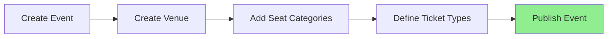

# 🎟️ Event Management System (EMS)

<div align="center">

A full-stack event management platform enabling organizers to create, configure, and publish events with custom venues, seating structures, and ticket types.

**Final Year Academic Project**

[](https://nodejs.org/)
[](https://reactjs.org/)
[](https://www.postgresql.org/)
[](https://www.prisma.io/)

</div>

---

## 📋 Table of Contents

- [Core Philosophy](#-core-philosophy)
- [Key Features](#-key-features)
- [Roles](#-roles)
- [System Architecture](#-system-architecture)
- [Data Model](#-data-model-overview)
- [Project Structure](#-project-structure)
- [Setup Instructions](#-setup-instructions)
- [Workflow](#-organizer-workflow)
- [Academic Context](#-academic-notes)
- [Author](#-author)

---

## 🎯 Core Philosophy

- **Event-Owned Venues** – Each event has its own unique venue configuration
- **Hierarchical Seating** – Seat categories define pricing tiers (VIP, Regular, etc.)
- **Flexible Ticket Types** – Map ticket types to seat categories with custom pricing
- **Workflow Enforcement** – Events must be fully configured before publishing
- **Data Isolation** – Strict organizer-level access control

---

## ✨ Key Features

### For Organizers
- ✅ Create and manage events
- ✅ Configure custom venues with multiple layout types
- ✅ Define seat categories and ticket types
- ✅ Publish events after validation
- ✅ View analytics and booking data

### For Administrators
- ✅ Platform-level analytics
- ✅ Monitor all events and organizers
- ✅ System-wide reporting

### Technical Highlights
- 🔐 JWT-based authentication
- 🛡️ Role-based access control (RBAC)
- 📊 Real-time validation and error handling
- 🎨 Modular, scalable architecture
- 📱 Responsive UI design

---

## 👥 Roles

| Role | Capabilities |
|------|-------------|
| **Organizer** | Create events, manage venues, configure seating, define tickets, publish events |
| **Admin** | View analytics, monitor platform activity, access system-wide data |

---

## 🧭 Organizer Workflow

The system enforces a strict step-by-step process:



> **Note:** Publishing is blocked until all requirements are met. Steps cannot be skipped.

**Publishing Requirements:**
- ✓ Venue configured
- ✓ At least one seat category
- ✓ At least one ticket type

**Post-Publishing:**
- Events become **read-only** for configuration
- Booking system is activated
- Orders and seat allocation begin

---

## 🏗️ System Architecture

### Backend Stack

| Technology | Purpose |
|-----------|---------|
| **Node.js + Express** | REST API server |
| **PostgreSQL** | Relational database |
| **Prisma ORM** | Type-safe database access |
| **JWT** | Authentication & authorization |

### Frontend Stack

| Technology | Purpose |
|-----------|---------|
| **React (Vite)** | UI framework |
| **React Router** | Client-side routing |
| **Axios** | HTTP client |

### Architecture Pattern

```
Modular Backend Architecture:
├── modules/
│   ├── event/
│   ├── venue/
│   ├── seatCategory/
│   ├── ticket/
│   ├── order/
│   ├── seats/
│   └── analytics/
```

---

## 🧩 Data Model Overview

### Core Entities

#### 🎪 Event
```
- Title, description, start/end datetime
- Status: DRAFT → PUBLISHED
- Allocation mode: MANUAL | AUTOMATED
- Owns exactly one venue
```

#### 🏛️ Venue (Event-Owned)
```
Layout Types:
├── ROW_COLUMN (theater-style)
├── GALLERY (standing sections)
├── ROUND_TABLE (banquet-style)
└── OPEN_CROWD (festival-style)

Configuration stored as JSON
```

#### 🎫 Seat Category
```
- Belongs to an event
- Defines hierarchy (VIP, Regular, Economy)
- Optional capacity limits
```

#### 💳 Ticket Type
```
- Belongs to an event
- Price-based
- Maps to one or more seat categories
```

#### 📦 Orders & Seats
```
- Activated post-publishing
- Supports manual/automated allocation
- Tracks booking status
```

---

## 📂 Project Structure

<details>
<summary><b>Backend Structure</b></summary>

```
ems-backend/
│
├── prisma/
│   ├── schema.prisma          # Database schema
│   └── migrations/            # Migration history
│
├── src/
│   ├── modules/
│   │   ├── event/             # Event management
│   │   ├── venue/             # Venue configuration
│   │   ├── seatCategory/      # Seat categories
│   │   ├── ticket/            # Ticket types
│   │   ├── order/             # Order processing
│   │   ├── seats/             # Seat allocation
│   │   └── analytics/         # Analytics & reporting
│   │
│   ├── common/
│   │   ├── middleware/        # Auth, validation, error handling
│   │   └── errors/            # Custom error classes
│   │
│   ├── routes/                # API route definitions
│   ├── config/                # Environment & app config
│   ├── app.js                 # Express app setup
│   └── server.js              # Server entry point
│
├── .env                       # Environment variables
└── package.json
```

</details>

<details>
<summary><b>Frontend Structure</b></summary>

```
ems-frontend/
│
├── src/
│   ├── api/
│   │   ├── organizer.api.js   # Organizer API calls
│   │   └── admin.api.js       # Admin API calls
│   │
│   ├── pages/
│   │   ├── organizer/
│   │   │   ├── Events/        # Event management UI
│   │   │   ├── Venues/        # Venue configuration UI
│   │   │   ├── SeatCategories/ # Seat category UI
│   │   │   └── Tickets/       # Ticket type UI
│   │   │
│   │   └── admin/             # Admin dashboard
│   │
│   ├── layouts/               # Layout components
│   ├── auth/                  # Authentication flows
│   ├── components/            # Reusable components
│   └── App.jsx                # Root component
│
├── public/
└── package.json
```

</details>

---

## 🚀 Setup Instructions

### Prerequisites

- Node.js (v16 or higher)
- PostgreSQL (v13 or higher)
- npm or yarn

### Backend Setup

```bash
# Navigate to backend directory
cd ems-backend

# Install dependencies
npm install

# Configure environment variables
cp .env.example .env
# Edit .env with your database credentials

# Run database migrations
npx prisma migrate dev

# Generate Prisma Client
npx prisma generate

# Start development server
npm run dev
```

The backend will run on `http://localhost:5000` (or your configured port)

### Frontend Setup

```bash
# Navigate to frontend directory
cd ems-frontend

# Install dependencies
npm install

# Configure API endpoint
# Create .env file and set VITE_API_URL=http://localhost:5000

# Start development server
npm run dev
```

The frontend will run on `http://localhost:5173`

### Database Setup

```bash
# Optional: View database in Prisma Studio
npx prisma studio
```

---

## 🔐 Access Control

- **JWT-based authentication** for secure session management
- **Middleware-driven role enforcement** at the route level
- **Organizers** can only access their own events and data
- **Admins** have read-only access to platform-wide data
- **No cross-organizer data access** – strict isolation

---

## 🧪 Project Status

| Module | Status |
|--------|--------|
| Organizer Flow | ✅ Complete |
| Event Publishing Rules | ✅ Enforced |
| Seat Allocation & Orders | ✅ Structured |
| Admin Dashboard | ✅ Implemented |
| User Booking Interface | 🚧 Future Enhancement |
| Payment Integration | 🚧 Future Enhancement |

---

## 🎓 Academic Notes

This project demonstrates key software engineering concepts:

- ✅ **Domain-Driven Design** – Clear separation of business logic
- ✅ **Relational Database Modeling** – Normalized schema with referential integrity
- ✅ **Backend Validation** – Business rules enforced at the API layer
- ✅ **Clean Architecture** – Modular, testable, and maintainable code
- ✅ **Full-Stack Integration** – Seamless frontend-backend communication
- ✅ **Role-Based Access Control** – Secure multi-tenant architecture

---

## 🔮 Future Enhancements

- [ ] User-facing ticket booking interface
- [ ] Interactive seat selection UI (manual allocation mode)
- [ ] Payment gateway integration (Stripe/Razorpay)
- [ ] QR code-based ticket validation
- [ ] Email notifications for bookings
- [ ] Mobile app (React Native)
- [ ] Real-time seat availability updates (WebSockets)

---

## 📄 License

This project is developed as an academic project and is available for educational purposes.

---

## 👤 Author

**Vinaya Rajput**  
Final Year Academic Project  
Event Management System

---

## 🙏 Acknowledgments

Special thanks to:
- Open-source community for excellent tools and libraries

---

<div align="center">

**⭐ Star this repository if you found it helpful!**

Made with ❤️ for academic excellence

</div>
